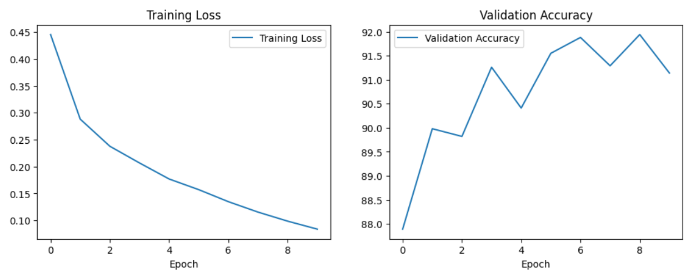
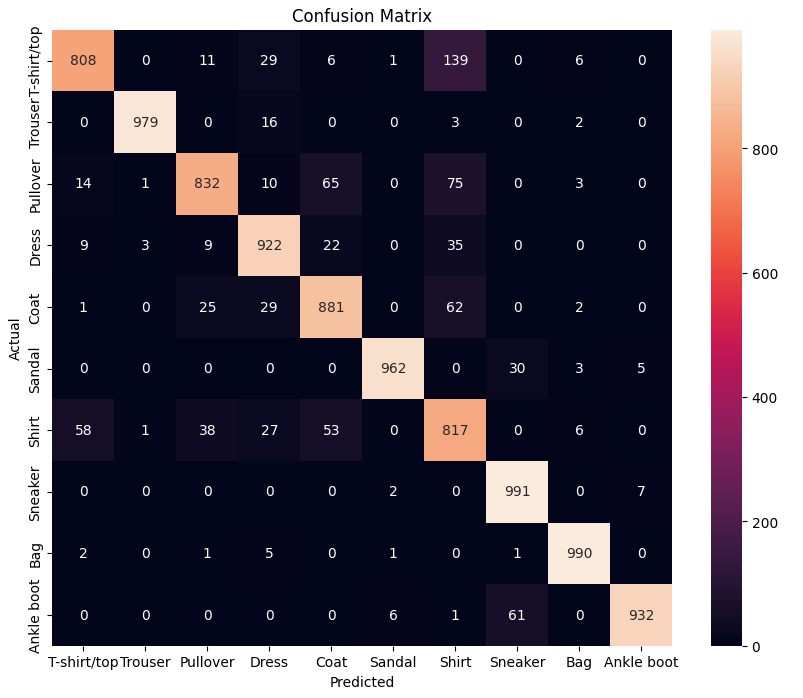

# Fashion MNIST Classification with CNN

A PyTorch implementation of a Convolutional Neural Network (CNN) to classify clothing images from the Fashion MNIST dataset.

## Accuracy
Achieves **~92% accuracy** on the test set.

## Requirements
- Python 3.8+
- PyTorch
- torchvision

Install dependencies:
```bash
pip install -r requirements.txt
```
## Results
Achieved **91.14% test accuracy** after 10 epochs:

### Training Progress


### Confusion Matrix


### Sample Predictions
```text
GroundTruth: Ankle boot      Pullover        Trouser         Trouser         Shirt           Trouser         Coat            Shirt          
Predicted:   Ankle boot      Pullover        Trouser         Trouser         Shirt           Trouser         Coat            Shirt
```
